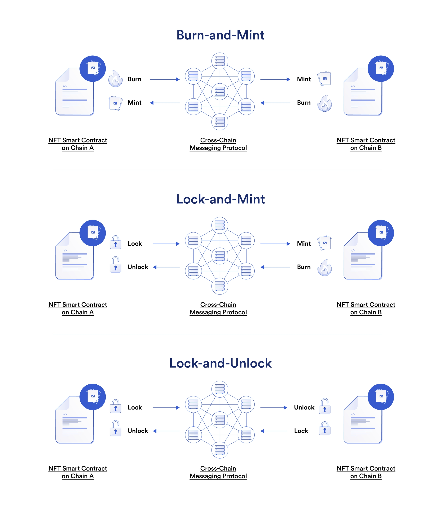

## Burn and Mint Cross-Chain NFT

> **Note**
>
> Previous version of this repo (cross-chain NFT minting) has been moved to the [cross-chain-nft-minter-example branch](https://github.com/smartcontractkit/ccip-cross-chain-nft/tree/cross-chain-nft-minter-example).

A cross-chain NFT is a smart contract that can exist on any blockchain, abstracting away the need for users to understand which blockchain they’re using.

## Prerequisites

-   [Foundry](https://book.getfoundry.sh/getting-started/installation)

## Getting Started

1. Install packages

```
forge install
```

Or:

```
forge install foundry-rs/forge-std --no-commit
forge install OpenZeppelin/openzeppelin-contracts --no-commit
```

And:

```
npm install
```

2. Compile contracts

```
forge build
```

3. Create a new file by copying the `.env.example` file, and name it `.env`. Fill in with Ethereum Sepolia and Arbitrum Sepolia RPC URLs using either local archive nodes or a service that provides archival data, like [Infura](https://infura.io/) or [Alchemy](https://alchemy.com/).

```
ETHEREUM_SEPOLIA_RPC_URL=""
ARBITRUM_SEPOLIA_RPC_URL=""
```

4. Run tests

```
forge test
```

## How Do Cross-Chain NFTs Work?

At a high level, an NFT is a digital token on a blockchain with a unique identifier different from any other token on the chain.

Any NFT is implemented by a smart contract that is intrinsically connected to a single blockchain. The smart contract is arguably the most important part of this equation because it controls the NFT implementation: How many are minted, when, what conditions need to be met to distribute them, and more. This means that any cross-chain NFT implementation requires at least two smart contracts on two blockchains and interconnection between them.

This is what a cross-chain NFT looks like - equivalent NFTs that exist across multiple blockchains.

With this in mind, cross-chain NFTs can be implemented in three ways:

-   **Burn-and-mint**: An NFT owner puts their NFT into a smart contract on the source chain and burns it, in effect removing it from that blockchain. Once this is done, an equivalent NFT is created on the destination blockchain from its corresponding smart contract. This process can occur in both directions.

-   **Lock-and-mint**: An NFT owner locks their NFT into a smart contract on the source chain, and an equivalent NFT is created on the destination blockchain. When the owner wants to move their NFT back, they burn the NFT and it unlocks the NFT on the original blockchain.

-   **Lock and unlock**: The same NFT collection is minted on multiple blockchains. An NFT owner can lock their NFT on a source blockchain to unlock the equivalent NFT on a destination blockchain. This means only a single NFT can actively be used at any point in time, even if there are multiple instances of that NFT across blockchains.



> **Note**
>
> _This repository represents an example of using a Chainlink product or service. It is provided to help you understand how to interact with Chainlink’s systems so that you can integrate them into your own. This template is provided "AS IS" without warranties of any kind, has not been audited, and may be missing key checks or error handling to make the usage of the product more clear. Take everything in this repository as an example and not something to be copy pasted into a production ready service._
